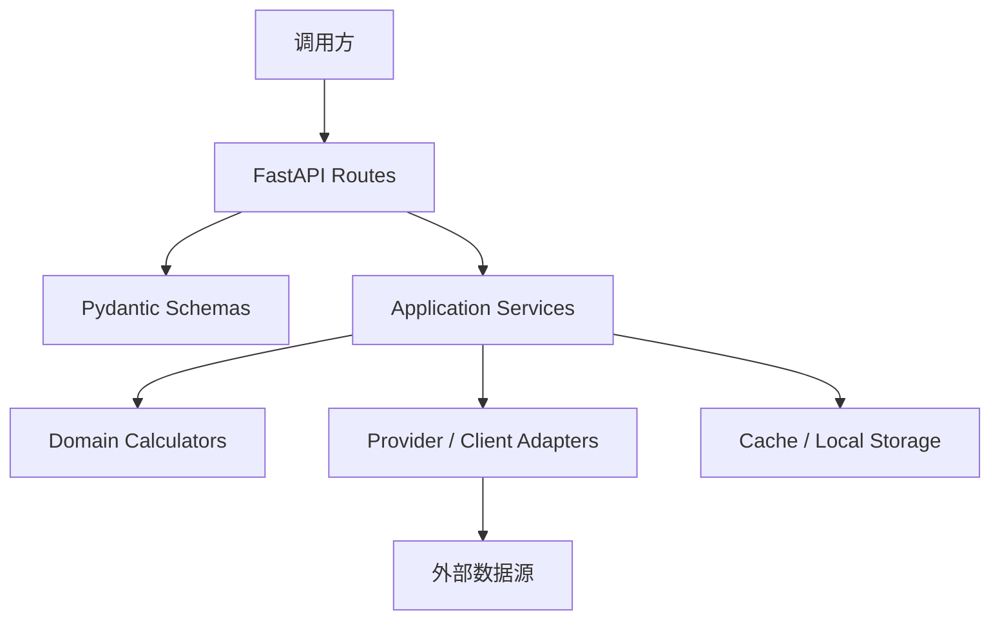

# a-stock-data API 服务化开发指导

## 1. 文档目标

本文件是 a-stock-data 服务化的设计基线。

阅读方式：

- 先用本文件确定目标架构、模块边界、协作方式和测试策略
- 再用 [API_SERVICE_MVP_TASK_BREAKDOWN.md](API_SERVICE_MVP_TASK_BREAKDOWN.md) 决定当前阶段和当前切片
- 如果遇到实现分歧，再回看本文件对应章节

当前总目标：将 [SKILL.md](SKILL.md) 中已经验证过的能力重构为可调用、可测试、可部署的 HTTP API 服务，同时保持业务语义等价。

本文件聚焦四件事：

- 当前项目到底已经有什么
- 应该如何拆模块
- 模块之间如何协作才能完整完成任务
- 如何分阶段实现、测试、验证并收敛风险

## 2. 对当前项目的理解

### 2.1 项目现状

当前仓库本质上是“文档即代码”的形态：

- [README.md](README.md) 负责说明能力边界、安装方式、典型用法和使用场景
- [SKILL.md](SKILL.md) 是核心交付物，里面同时包含：
  - Skill 元信息
  - 数据源说明
  - 内嵌 Python 代码
  - 多个完整工作流示例
- [CHANGELOG.md](CHANGELOG.md) 记录了近期对上游接口变化的修复和兼容策略

也就是说，项目真正有价值的部分并不是“Skill 机制本身”，而是 [SKILL.md](SKILL.md) 里已经验证过的 38 个函数和它们背后的 13 个数据源整合逻辑。

### 2.2 当前能力版图

当前能力覆盖 7 层：

- 行情层：腾讯财经、mootdx、百度 K 线
- 研报层：东财研报、同花顺一致预期、iwencai 语义搜索
- 信号层：同花顺热点、北向资金、板块归属（东财 slist）、资金流、龙虎榜、解禁、行业比较
- 资金面 / 筹码层：融资融券、大宗交易、股东户数、分红送转、120 日资金流
- 新闻层：个股新闻、全球资讯（财联社快讯已下线 #14）
- 基础数据层：季报快照、F10、东财基本面、新浪三表
- 公告层：巨潮公告

除此之外，还有一层隐含但非常重要的“聚合层”：

- 估值计算函数：前向 PE、PEG、PE 消化时间
- 工作流函数：如 [full_valuation](SKILL.md#L1747)

### 2.3 当前代码特征

从服务化的角度看，当前代码有几个明显特征：

- 大多数上游是直连 HTTP API，只有 mootdx 走 TCP
- 返回类型并不统一，既有 dict/list，也有 pandas DataFrame
- 一些逻辑包含本地缓存，比如北向资金 CSV 缓存
- 一些端点强依赖特殊 Header 或参数，例如 iwencai 的 X-Claw、东财全球资讯的 req_trace、巨潮公告的 orgId 规则
- 业务逻辑和数据获取逻辑目前混在同一个 Markdown 文件里

这意味着：

- 项目非常适合服务化
- 但不适合直接把 [SKILL.md](SKILL.md) 原样当运行时入口

## 3. 服务化的核心原则

### 3.1 不要运行时解析 Markdown

第一原则：不要把 [SKILL.md](SKILL.md) 当作运行时动态脚本源去解析和执行。

正确做法是：

- 以 [SKILL.md](SKILL.md) 为实现蓝本
- 把函数抽取为正常的 Python 模块
- 建立清晰的服务层、适配层和接口层

原因很简单：

- Markdown 运行时解析难维护
- 不利于类型约束、测试、重构和调试
- 很难做细粒度模块边界和依赖管理

### 3.2 保持能力等价，不要重写业务语义

服务化的目标不是重新发明一套 A 股数据抓取逻辑，而是把当前仓库中已经验证过的能力包装成标准服务。

因此要遵循：

- 优先保持函数语义不变
- 优先复用当前数据源选择和已知兼容策略
- 优先把“可运行”升级为“可调用、可测试、可观测”

### 3.3 先做稳定骨架，再逐层扩展

虽然仓库现有能力有 28 个端点，但不建议一口气全量服务化。更合理的路径是：

- 先建立服务骨架和公共基础设施
- 先落地高频、低风险、HTTP 直连的核心接口
- 再扩展到复杂数据源、聚合流程和 TCP 场景

### 3.4 把“数据源差异”隔离在 Provider 层

上游接口的 Header、编码、鉴权、字段、容错、分页都不同。不要把这些差异泄漏到 API 路由层。

应该把差异全部关在 Provider / Client 层中，API 对外只暴露统一且稳定的契约。

### 3.5 集成 Karpathy Guidelines 作为执行约束

本指南同时吸收 [andrej-karpathy-skills-main/skills/karpathy-guidelines/SKILL.md](andrej-karpathy-skills-main/skills/karpathy-guidelines/SKILL.md) 的四条行为规则，并将其落到当前项目的工程执行中。

#### 编码前思考

- 每个非琐碎阶段开始前，先写清楚 4 项：假设、歧义点、最小可行切片、验证方式
- 如果歧义会改变 API 契约、目录结构、鉴权方式、数据源选择、缓存策略，就先澄清，不要静默选择
- 如果歧义不影响主路径推进，就明确写出假设后继续，不要因为小问题停住整个任务

#### 简洁优先

- MVP 阶段不要为了“以后可能会用到”提前引入 repository、factory、base client、多态配置层
- 单个 Provider 只有一个调用方时，不要先抽象成通用平台层
- 没有第二个真实调用点前，不要创建“可扩展性”抽象
- 如果一个切片写到明显超过问题本身的复杂度，就回退并改成更短、更直接的实现

#### 精准修改

- 每一次改动都必须能追溯到当前阶段目标或当前失败测试
- 发现无关死代码、无关重构机会、无关格式问题时，只记录，不顺手修改
- 只清理因为当前改动而产生的无用导入、无用变量和无用函数

#### 目标驱动执行

- 每个阶段都必须写成“步骤 -> 验证”的形式
- 不接受“先写完再统一测试”的推进方式
- 先定义成功标准，再开始编码；没有成功标准的任务，先把成功标准补出来

这套约束的本质是：宁可慢一点，也不要在非琐碎任务里靠隐含假设和过度工程把项目带偏。

### 3.6 项目专用反例 / 正例页

为了避免 Karpathy 原始示例只停留在通用软件场景，本项目额外提供了一页贴合当前 API 服务化任务的项目专用示例：[API_SERVICE_PROJECT_EXAMPLES.md](API_SERVICE_PROJECT_EXAMPLES.md)。

建议使用方式：

- 在开始新的 Phase 前先看对应原则下的项目示例
- 当你不确定某个切片是不是过度设计时，先对照本页的反例
- 当你不确定验证方式够不够具体时，先对照本页的正例

这页示例不是附录，而是对本指南“如何执行”的具体化补充。

## 4. 目标架构

建议采用分层架构，而不是把所有逻辑塞进 routes。



### 4.1 路由层

职责：

- 接收 HTTP 请求
- 解析参数
- 调用服务层
- 返回统一响应结构

不应该做的事：

- 不要直接写 requests 调用
- 不要直接写 DataFrame 解析
- 不要在这里做复杂聚合

### 4.2 服务层

职责：

- 组织一个业务动作的完整流程
- 协调多个 Provider
- 应用缓存、限流、降级、聚合、转换
- 组装最终返回结果

例子：

- valuation_service：调用腾讯行情 + 同花顺一致预期 + 估值计算器
- research_service：调用 iwencai + 东财研报 + PDF 下载信息
- investigation_service：执行“新标的调研”多步流程

### 4.3 Provider 层

职责：

- 处理单一上游数据源的访问
- 封装 Header、URL、分页、鉴权、编码、字段映射
- 把原始响应转为内部统一结构

Provider 建议按数据源拆分，而不是按 API 路由拆分。

### 4.4 Domain / Calculation 层

职责：

- 只做纯计算和纯转换
- 不依赖网络
- 保持高可测性

典型函数：

- forward_pe
- pe_digestion
- calc_peg
- 股票代码归一化
- 巨潮 orgId 生成
- 腾讯字段解析

### 4.5 基础设施层

职责：

- 配置读取
- HTTP Session
- 重试与超时
- 缓存
- 日志
- 指标
- 错误包装

## 5. 推荐目录结构

建议把项目整理为如下结构：

```text
a-stock-data/
├── app/
│   ├── main.py
│   ├── api/
│   │   ├── deps.py
│   │   └── routes/
│   │       ├── health.py
│   │       ├── market.py
│   │       ├── research.py
│   │       ├── signals.py
│   │       ├── capital.py
│   │       ├── news.py
│   │       ├── fundamentals.py
│   │       └── filings.py
│   ├── core/
│   │   ├── config.py
│   │   ├── constants.py
│   │   ├── errors.py
│   │   ├── logging.py
│   │   ├── http.py
│   │   └── normalize.py
│   ├── schemas/
│   │   ├── common.py
│   │   ├── market.py
│   │   ├── research.py
│   │   ├── signals.py
│   │   ├── capital.py
│   │   ├── news.py
│   │   ├── fundamentals.py
│   │   └── filings.py
│   ├── providers/
│   │   ├── tencent.py
│   │   ├── eastmoney.py
│   │   ├── ths.py
│   │   ├── iwencai.py
│   │   ├── baidu.py
│   │   ├── sina.py
│   │   ├── cninfo.py
│   │   ├── cls.py
│   │   └── mootdx_client.py
│   ├── services/
│   │   ├── market_service.py
│   │   ├── valuation_service.py
│   │   ├── research_service.py
│   │   ├── signal_service.py
│   │   ├── capital_service.py
│   │   ├── news_service.py
│   │   ├── fundamentals_service.py
│   │   ├── filings_service.py
│   │   └── workflow_service.py
│   ├── domain/
│   │   ├── valuation.py
│   │   ├── parsing.py
│   │   └── identifiers.py
│   └── storage/
│       ├── files.py
│       └── cache.py
├── tests/
│   ├── unit/
│   ├── integration/
│   ├── contract/
│   └── smoke/
├── scripts/
├── pyproject.toml
├── README.md
├── SKILL.md
└── CHANGELOG.md
```

### 5.1 工程初始化最低基线

为了保证 MVP 能真正启动、测试和演进，建议在第一次开工时就补齐最小依赖基线，而不是等到写到一半再回补。

#### MVP 运行时依赖

- fastapi
- uvicorn
- requests
- pandas
- lxml
- pydantic-settings（推荐，用于集中配置管理）

说明：

- pandas + lxml 不是可有可无的。当前 [SKILL.md](SKILL.md) 中的同花顺一致预期使用 `pandas.read_html`，如果不提前纳入依赖，估值链路会在真正实现时卡住。
- MVP 暂不需要引入 mootdx、stockstats、Redis、Celery 这类能力或基础设施。

#### MVP 开发依赖

- pytest
- responses 或 requests-mock
- httpx
- ruff

#### 首批建议命令

```bash
pip install fastapi uvicorn requests pandas lxml pydantic-settings
pip install -U pytest responses httpx ruff
uvicorn app.main:app --reload
pytest
```

#### 最小交付基线

至少保证以下文件在 Phase 1 前后出现：

- `pyproject.toml` 或等价依赖清单
- `app/main.py`
- `tests/` 基础目录
- 可执行的启动命令
- 可执行的测试命令

## 6. 模块划分建议

### 6.1 公共基础模块

#### core.normalize

职责：

- 股票代码归一化
- 市场前缀计算
- 指数 / ETF 代码识别

建议抽取的能力：

- get_prefix
- normalize_code
- to_tencent_symbol
- to_eastmoney_secid
- to_cninfo_org_id

#### core.http

职责：

- requests.Session 管理
- 默认超时
- Retry 策略
- 标准 User-Agent
- 统一错误包装

#### core.errors

定义统一异常：

- ValidationError
- UpstreamHTTPError
- UpstreamSchemaError
- ProviderAuthError
- ProviderRateLimitError
- ServiceDegradedError

### 6.2 行情模块

对应当前函数：

- [tencent_quote](SKILL.md#L211)
- [baidu_kline_with_ma](SKILL.md#L313)
- mootdx K 线 / quotes / transaction 相关代码段

建议拆分：

- providers.tencent
- providers.baidu
- providers.mootdx_client
- services.market_service
- schemas.market

API 建议：

- GET /api/v1/quote
- GET /api/v1/kline/baidu/{code}
- GET /api/v1/mootdx/bars/{code}
- GET /api/v1/mootdx/quotes
- GET /api/v1/mootdx/transactions/{code}

实现注意：

- 腾讯返回 GBK 编码 + 波浪线字段
- 腾讯字段索引必须固化测试，尤其是 43 和 46
- mootdx 应单独隔离为可降级组件，因为它依赖 TCP 网络环境

### 6.3 研报模块

对应当前函数：

- [eastmoney_reports](SKILL.md#L361)
- [download_pdf](SKILL.md#L386)
- [ths_eps_forecast](SKILL.md#L434)
- [iwencai_search](SKILL.md#L487)
- [iwencai_query](SKILL.md#L515)
- [dedup_articles](SKILL.md#L543)

建议拆分：

- providers.eastmoney
- providers.ths
- providers.iwencai
- domain.parsing
- services.research_service
- services.valuation_service

实现注意：

- 同花顺一致预期是 HTML 表格解析，不应把 DataFrame 直接暴露给 API
- iwencai 必须通过环境变量读取 Key
- PDF 下载不应默认在 API 请求里落盘，建议支持两种模式：
  - 返回下载链接 / 元数据
  - 显式调用下载接口并保存到指定目录或对象存储

### 6.4 信号模块

对应当前函数：

- [ths_hot_reason](SKILL.md#L577)
- [hsgt_realtime](SKILL.md#L660)
- [_northbound_cache_path](SKILL.md#L682)
- [_save_northbound_snapshot](SKILL.md#L688)
- [_load_northbound_history](SKILL.md#L703)
- [baidu_concept_blocks](SKILL.md#L741)
- [eastmoney_fund_flow_minute](SKILL.md#L792)
- [dragon_tiger_board](SKILL.md#L853)
- [lockup_expiry](SKILL.md#L946)
- [industry_comparison](SKILL.md#L1011)
- [daily_dragon_tiger](SKILL.md#L1067)

建议拆分：

- providers.ths
- providers.baidu
- providers.eastmoney
- storage.files 或 cache
- services.signal_service

实现注意：

- 北向缓存不能继续写死到用户 Home 路径，必须可配置
- 若未来要多实例部署，北向缓存应迁移到 Redis 或数据库
- 龙虎榜与解禁等东财数据中心接口建议统一走 eastmoney_datacenter helper

### 6.5 资金面 / 筹码模块

对应当前函数：

- [margin_trading](SKILL.md#L1156)
- [block_trade](SKILL.md#L1190)
- [holder_num_change](SKILL.md#L1227)
- [dividend_history](SKILL.md#L1259)
- [stock_fund_flow_120d](SKILL.md#L1292)

建议拆分：

- providers.eastmoney
- services.capital_service
- schemas.capital

实现注意：

- 这些函数都属于“列表型明细接口”，非常适合统一分页、统一 envelope
- 金额和数量字段要统一单位，返回时建议注明原始单位

### 6.6 新闻模块

对应当前函数：

- [eastmoney_stock_news](SKILL.md#L1355)
- [cls_telegraph](SKILL.md#L1405)
- [eastmoney_global_news](SKILL.md#L1438)

建议拆分：

- providers.eastmoney
- providers.cls
- services.news_service

实现注意：

- 东财全球资讯 req_trace 必须写入测试用例，避免回归 403
- 资讯类接口建议支持 page_size 参数和按时间排序的统一输出格式

### 6.7 基础数据模块

对应当前函数：

- [eastmoney_stock_info](SKILL.md#L1517)
- [sina_financial_report](SKILL.md#L1554)
- mootdx finance / F10 代码段

建议拆分：

- providers.eastmoney
- providers.sina
- providers.mootdx_client
- services.fundamentals_service

实现注意：

- F10 是文本型接口，建议在服务层做文本截断策略
- 财报三表返回字段不稳定时，应保留原字段名，不要过早强制标准化到单一中文模型

### 6.8 公告模块

对应当前函数：

- [_cninfo_ts_to_date](SKILL.md#L1605)
- [cninfo_announcements](SKILL.md#L1611)

建议拆分：

- providers.cninfo
- services.filings_service
- schemas.filings

实现注意：

- 巨潮 orgId 生成是强回归点，必须独立测试
- announcementTime 的转换应统一在转换层处理

### 6.9 聚合工作流模块

对应当前函数：

- [forward_pe](SKILL.md#L1681)
- [pe_digestion](SKILL.md#L1693)
- [calc_peg](SKILL.md#L1709)
- [full_valuation](SKILL.md#L1747)

这是服务化后的高价值模块，建议独立出来，不要散落在路由中。

建议拆分：

- domain.valuation
- services.valuation_service
- services.workflow_service

它负责把“基础端点”编排成“业务动作”。

## 7. 模块之间如何协调完成任务

这是整个服务化最关键的部分。单个 Provider 很容易写，真正有价值的是多个模块如何协作并稳定输出结果。

### 7.1 场景一：完整估值

目标：提供一个比当前 [full_valuation](SKILL.md#L1747) 更稳定、可对外调用的接口。

推荐流程：

1. 路由层接收股票代码
2. normalize 模块统一代码格式
3. valuation_service 调用 tencent provider 拉最新价格、PE、PB、市值
4. valuation_service 调用 ths provider 拉一致预期 EPS
5. parsing 模块从 DataFrame 提取 eps_cur、eps_next、analyst_count
6. domain.valuation 执行前向 PE、PEG、PE 消化年数计算
7. schemas 负责把 inf / NaN 转换成可序列化字段
8. 返回统一 JSON

关键边界：

- 行情抓取不能耦合估值计算
- HTML 表格解析不能污染 API 路由
- 估值计算必须是纯函数，保证可单元测试

### 7.2 场景二：新标的调研

这是未来最有产品价值的复合 API，不是简单的一问一答，而是一个聚合流程。

推荐拆成 workflow_service，内部按步骤调用：

1. quote / stock_info：拿股票基本信息和实时价格
2. valuation：拿估值结果
3. concept_blocks：拿行业 / 概念 / 地域归属
4. fund_flow_minute：拿当日主力资金趋势
5. dragon_tiger_board：拿最近上榜情况
6. lockup_expiry：拿未来解禁风险
7. margin_trading：拿两融变化
8. news / announcements：拿最近资讯和公告
9. 汇总成一个统一结构返回

这里的关键不是“都能调通”，而是：

- 各子步骤允许局部失败
- 整体接口仍可返回部分结果和 warnings
- 每个子步骤都标注数据源和抓取时间

### 7.3 场景三：批量横向比较

如果要支持多个股票批量比较，服务层不应该串行粗暴 for 循环到底。

推荐策略：

- 控制批量上限，例如 20 或 50
- 对同质 HTTP 请求做受控并发
- 聚合结果时保留成功项和失败项
- 失败项附带错误说明，不要因为一只股票失败导致全量失败

### 7.4 调用协作规则

建议明确以下协作规则：

- 路由层只能调用服务层，不直接调用 Provider
- 服务层可以组合多个 Provider，但 Provider 之间不要互相调用
- 纯计算逻辑只放在 domain 层
- 缓存只能由服务层或基础设施层管理
- Schema 负责最后一层输出稳定化，不负责抓数

## 8. API 设计建议

### 8.1 基础原则

- 所有接口统一挂在 /api/v1 下
- 统一响应 envelope
- 统一错误结构
- 日期统一为 YYYY-MM-DD 或 ISO8601
- 股票代码统一返回 6 位数字 + 可选市场字段

### 8.2 响应结构建议

建议统一为：

```json
{
  "success": true,
  "request_id": "uuid",
  "data": {},
  "source": ["tencent", "10jqka"],
  "cached": false,
  "warnings": [],
  "fetched_at": "2026-05-28T10:30:00+08:00"
}
```

失败时：

```json
{
  "success": false,
  "request_id": "uuid",
  "error": {
    "code": "UPSTREAM_HTTP_ERROR",
    "message": "eastmoney returned 403",
    "provider": "eastmoney"
  },
  "warnings": []
}
```

### 8.3 第一阶段建议开放的接口

优先做这些接口：

- GET /api/v1/health
- GET /api/v1/quote?codes=600519,000858
- GET /api/v1/valuation/{code}
- GET /api/v1/reports/{code}
- GET /api/v1/fund-flow/minute/{code}
- GET /api/v1/margin/{code}
- GET /api/v1/block-trade/{code}
- GET /api/v1/announcements/{code}
- GET /api/v1/news/{code}
- GET /api/v1/stock-info/{code}

这些接口的特点是：

- 业务价值高
- 可验证性强
- 主要依赖 HTTP 数据源
- 不需要先解决最复杂的 TCP 和大规模缓存问题

### 8.4 第二阶段再开放的接口

- GET /api/v1/hot-stocks
- GET /api/v1/northbound/realtime
- GET /api/v1/northbound/history
- GET /api/v1/concepts/{code}
- GET /api/v1/dragon-tiger/{code}
- GET /api/v1/daily-dragon-tiger
- GET /api/v1/lockup/{code}
- GET /api/v1/industry-ranking
- GET /api/v1/holders/{code}
- GET /api/v1/dividends/{code}
- GET /api/v1/fund-flow/120d/{code}
- GET /api/v1/global-news
- GET /api/v1/telegraph
- GET /api/v1/financial-report/{code}

### 8.5 第三阶段接口

- GET /api/v1/mootdx/bars/{code}
- GET /api/v1/mootdx/quotes
- GET /api/v1/mootdx/transactions/{code}
- GET /api/v1/f10/{code}
- GET /api/v1/workflows/full-investigation/{code}
- POST /api/v1/workflows/batch-valuation

## 9. 数据建模与序列化策略

### 9.1 不要直接返回 DataFrame

当前仓库里 DataFrame 很常见，但 API 层必须把它转换为稳定 JSON。建议统一规则：

- DataFrame -> list[dict]
- NaN -> null
- inf -> null 或字符串标记，但必须统一
- 时间列显式格式化

### 9.2 金额和单位要明确

当前上游有些字段是：

- 元
- 万
- 亿
- 股
- 手

服务层应决定统一策略。推荐：

- 优先返回原始字段 + 单位说明
- 如需派生字段，可额外返回标准化字段，例如 mcap_yi

### 9.3 代码和市场字段分开

不要把市场标识永远写死进 code 字段。推荐：

- code: 600519
- market: sh
- secid: 1.600519

这样有利于跨数据源复用。

## 10. 配置管理

建议统一从环境变量读取配置。

核心配置包括：

- APP_ENV
- APP_HOST
- APP_PORT
- LOG_LEVEL
- DEFAULT_HTTP_TIMEOUT
- DEFAULT_RETRY_COUNT
- CACHE_DIR
- ENABLE_MOOTDX
- IWENCAI_API_KEY
- IWENCAI_BASE_URL
- HTTP_PROXY
- HTTPS_PROXY

建议用一个 config.py 统一管理，不要散落在各模块中直接读取 os.environ。

## 11. 错误处理与降级策略

### 11.1 错误分类

需要区分以下错误：

- 输入参数错误
- 上游 HTTP 错误
- 上游返回结构变化
- 鉴权错误
- 网络超时
- 解析错误
- 部分聚合失败

### 11.2 聚合接口不要一刀切失败

像完整估值、新标的调研、批量比较这种聚合接口，应支持部分失败。

例如：

- 腾讯行情成功
- 同花顺一致预期解析失败

此时不应整个 valuation 接口直接 500。更合理的策略是：

- 返回行情结果
- eps 相关字段置空
- warnings 写明一致预期获取失败

### 11.3 已知高风险回归点

这些都必须单独测试：

- 腾讯字段 43 是振幅，不是 PB
- 腾讯字段 46 才是 PB
- 东财全球资讯必须有 req_trace
- 巨潮 stock 参数必须是 code,orgId
- 百度旧资金流接口已下线，资金流必须走东财 push2
- 北向历史依赖本地缓存逻辑

## 12. 缓存策略

### 12.1 哪些适合缓存

适合缓存：

- 行业排名
- 公告列表
- 新闻列表
- 个股基本面
- 研报列表
- 北向历史

不建议长期缓存：

- 实时报价
- 分钟级资金流
- 逐笔成交

### 12.2 建议缓存层级

第一阶段：

- 本地文件缓存或内存缓存即可

第二阶段：

- Redis

第三阶段：

- 如果有异步任务、定时刷新和多实例部署，再引入数据库或消息队列

## 13. 测试策略

服务化要成功，测试策略必须先于大规模编码确定。

### 13.1 单元测试

单元测试只测纯逻辑，不碰网络：

- 股票代码归一化
- 巨潮 orgId 生成
- 腾讯字段解析
- 估值计算
- 日期转换
- DataFrame -> JSON 转换

### 13.2 Provider 契约测试

用 mocked HTTP 响应验证 Provider：

- URL 和参数是否正确
- Header 是否正确
- 上游字段变动是否能被及时发现

推荐覆盖：

- tencent
- eastmoney datacenter
- eastmoney push2
- ths eps forecast
- iwencai
- cninfo
- cls
- sina

### 13.3 API 集成测试

使用 FastAPI TestClient 测：

- 路由参数校验
- 状态码
- JSON 结构
- envelope 格式
- 错误处理

### 13.4 回归测试

回归测试应直接来自 [CHANGELOG.md](CHANGELOG.md) 中已经踩过的坑：

- 资金流数据源切换是否仍为东财 push2
- 大宗交易报表名是否正确
- 龙虎榜机构席位筛选逻辑是否正确
- req_trace 是否存在
- 巨潮 orgId 是否正确

### 13.5 Live Smoke Tests

如果环境允许，可以保留少量 live 测试，但必须满足：

- 默认不在 CI 中跑
- 用 marker 区分
- 只做最小验证，不做大流量请求

## 14. 推荐实施顺序

### 阶段 0：先定设计，再开工

交付物：

- API 服务化设计文档
- 路由清单
- 模块拆分方案
- 测试方案

验收标准：

- 明确首批接口
- 明确 Provider 边界
- 明确缓存和错误策略

### 阶段 1：搭服务骨架

交付物：

- FastAPI 应用入口
- config / logging / errors / normalize
- health 路由
- 基础响应模型

验收标准：

- 服务能启动
- 健康检查可用
- 测试框架可运行

### 阶段 2：先做高价值 MVP

优先实现：

- quote
- valuation
- reports
- stock-info
- fund-flow-minute
- margin
- announcements
- news

验收标准：

- 每个接口都有单元测试 + 集成测试
- 至少一个聚合接口稳定运行

### 阶段 3：扩展信号和资金面

扩展：

- dragon tiger
- daily dragon tiger
- lockup
- industry ranking
- holders
- dividends
- fund-flow-120d

### 阶段 4：扩展新闻、财报、F10 和 TCP 能力

扩展：

- global news
- telegraph
- financial report
- F10
- mootdx bars / quotes / transaction

### 阶段 5：聚合流程与工程化收尾

收尾项：

- full investigation workflow
- batch valuation
- 缓存
- 监控
- 部署文档
- 回归审计

## 15. 自动测试、自动修复、自动验证循环建议

后续真正实现时，建议强制执行下面的循环，而不是“写完再一次性跑全部”。

### 15.1 单个切片循环

每完成一个切片，执行：

1. 实现最小代码切片
2. 运行最小相关测试
3. 如果失败，先修当前切片，不扩大范围
4. 修复后重跑同一组测试
5. 通过后再进入下一个切片

### 15.2 阶段循环

每完成一个阶段，执行：

1. 跑该阶段所有单元测试
2. 跑该阶段所有路由集成测试
3. 修复阶段内失败项
4. 更新文档

### 15.3 最终循环

项目末尾执行：

1. 全量单元测试
2. 全量集成测试
3. lint / type check
4. 可选 smoke tests
5. 设计与实现对比审计

## 16. 设计与实现的最终对比验证

最终必须生成一份“设计与实现对比表”，至少包含：

- 设计中的模块
- 最终实际实现的模块
- 是否一致
- 偏差原因
- 偏差是否可接受
- 是否影响验收目标

建议格式：

| 设计项 | 设计方案 | 实际实现 | 结论 | 备注 |
|---|---|---|---|---|
| 路由层 | FastAPI | FastAPI | 一致 | |
| 缓存层 | 本地缓存起步 | 本地缓存 + 可切 Redis | 一致 | 扩展性更好 |
| 北向缓存 | 可配置路径 | 可配置路径 | 一致 | |
| mootdx | 第三阶段 | 暂缓 | 可接受偏差 | 不影响 MVP |

## 17. 最终验收标准

可以把“服务化完成”定义为同时满足以下条件：

- 已从 [SKILL.md](SKILL.md) 中抽出结构化 Python 模块
- 已建立 FastAPI 服务入口
- 已落地首批核心 API
- 已建立单元测试、契约测试、集成测试
- 已覆盖 changelog 中的高风险回归点
- 已形成部署和配置说明
- 已完成设计与实现对比审计

## 18. 一句话结论

这个项目非常适合服务化，因为核心数据源大多已经是直连 HTTP API，当前最大的工作量不是“重新实现抓数”，而是把 [SKILL.md](SKILL.md) 中已经可用的逻辑，抽成稳定模块、建立服务边界、补齐测试与验证闭环。

从工程角度看，最重要的不是把 28 个接口一口气搬完，而是先搭对骨架，再以可验证的方式逐层扩展。